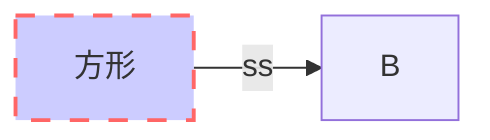
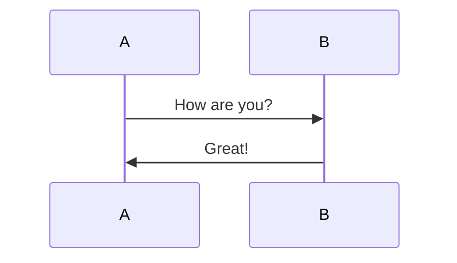
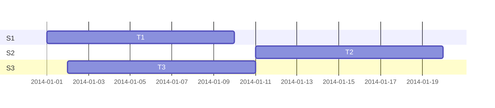
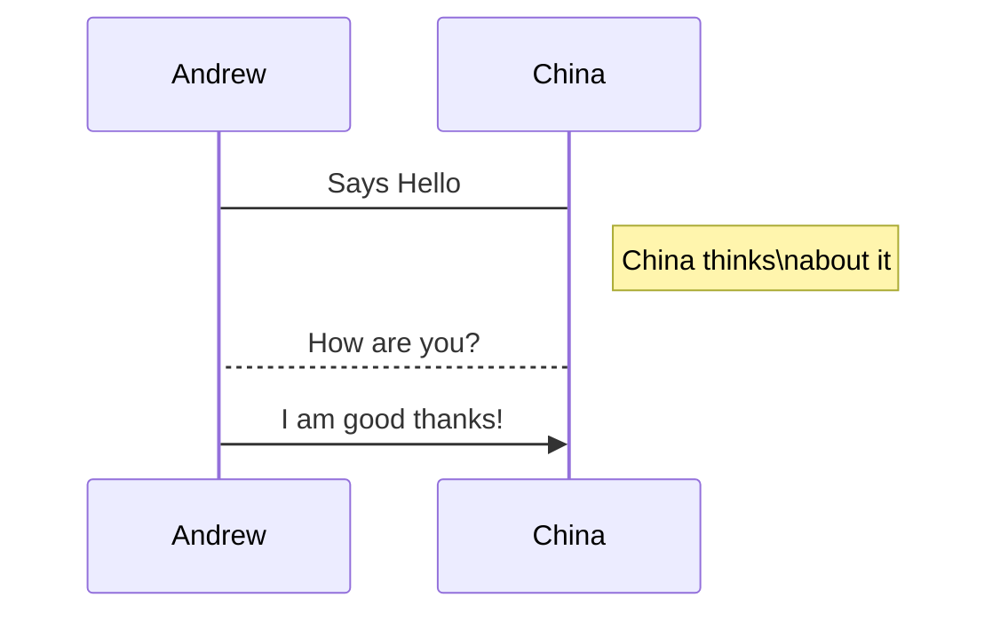
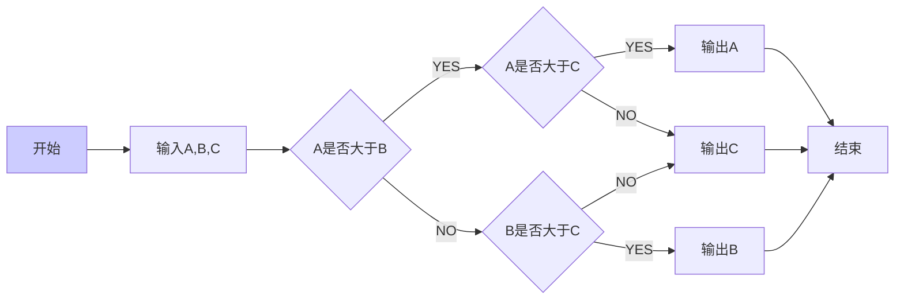
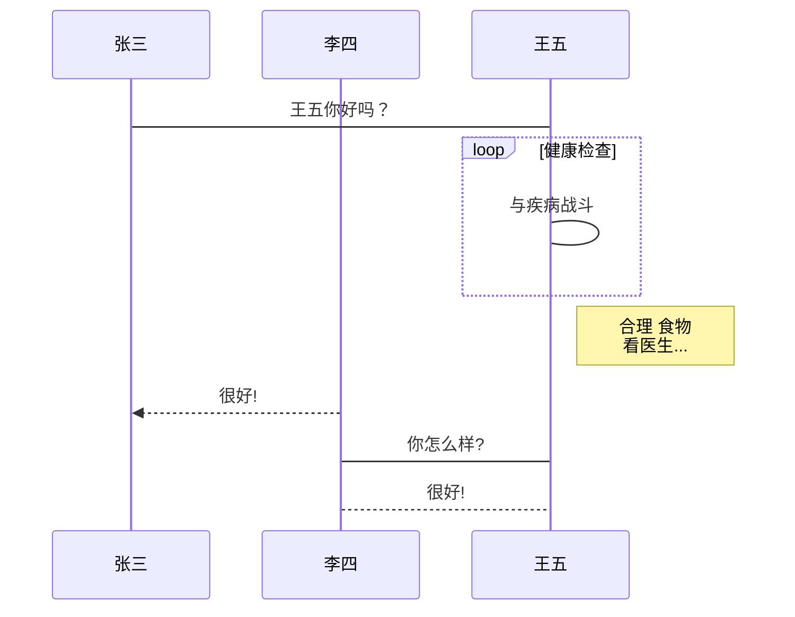
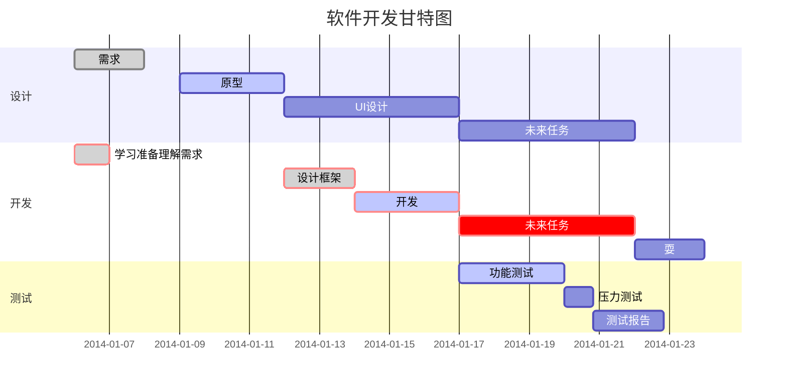

[TOC]


 # 苏大信科项目开发流程准则 
 <font style="color:red;font-size:100px;">红色大字体</font>







------------------------------



----
```sequence
起床->吃饭: 稀饭油条
吃饭->上班: 不要迟到了
上班->午餐: 吃撑了
上班->下班:
Note right of 下班: 下班了
下班->回家:
Note right of 回家: 到家了
回家-->>起床:
Note left of 起床: 新的一天
```







